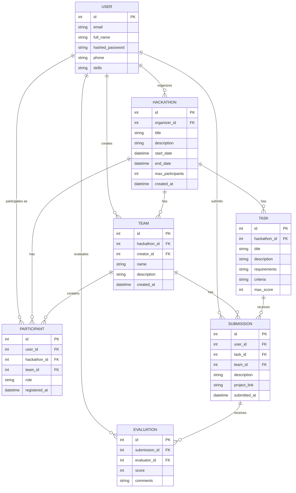

# Отчет по лабораторной работе


## Практика 1.1 — Воины (временная БД)

**Папка**: `../../prak/pr1/`

### Реализованные эндпоинты

| Метод | Путь | Описание |
|-------|------|----------|
| GET | `/warriors` | Получить всех воинов |
| GET | `/warriors/{warrior_id}` | Получить воина по ID |
| POST | `/warriors` | Создать нового воина |
| PUT | `/warriors/{warrior_id}` | Обновить воина |
| DELETE | `/warriors/{warrior_id}` | Удалить воина |
| GET | `/professions` | Получить все профессии |
| GET | `/skills` | Получить все навыки |

### Модели данных

```python
# models.py
class RaceType(str, Enum):
    director = "director"
    manager = "manager"
    accountant = "accountant"

class Profession(BaseModel):
    id: int
    title: str
    description: str

class Skill(BaseModel):
    id: int
    name: str
    description: str

class Warrior(BaseModel):
    id: int
    race: RaceType
    name: str
    level: int
    profession: Profession
    skills: list[Skill]
```

### Код соединения с БД

Используется временная in-memory база данных (список Python):

```python
# main.py (фрагмент)
temp_bd: list[dict] = [
    {
        "id": 1,
        "race": "director",
        "name": "Мартынов Дмитрий",
        "level": 12,
        "profession": {...},
        "skills": [...],
    },
]
```

---

## Практика 1.2 — Воины (ORM)

**Папка**: `prak/pr2/`

### Реализованные эндпоинты

| Метод | Путь | Описание |
|-------|------|----------|
| GET | `/warriors` | Получить всех воинов |
| GET | `/warriors/{warrior_id}` | Получить воина по ID |
| POST | `/warriors` | Создать нового воина |
| PATCH | `/warriors/{warrior_id}` | Обновить воина |
| DELETE | `/warriors/{warrior_id}` | Удалить воина |
| GET | `/professions` | Получить все профессии |
| POST | `/professions` | Создать профессию |
| GET | `/skills` | Получить все навыки |
| POST | `/skills` | Создать навык |

### Модели данных

```python
# models.py
class RaceType(str, Enum):
    director = "director"
    manager = "manager"
    accountant = "accountant"

class Profession(SQLModel, table=True):
    id: Optional[int] = Field(default=None, primary_key=True)
    title: str
    description: str

class Skill(SQLModel, table=True):
    id: Optional[int] = Field(default=None, primary_key=True)
    name: str
    description: str

class SkillWarriorLink(SQLModel, table=True):
    skill_id: Optional[int] = Field(default=None, foreign_key="skill.id"), primary_key=True)
    warrior_id: Optional[int] = Field(default=None, foreign_key="warrior.id"), primary_key=True)

class Warrior(SQLModel, table=True):
    id: Optional[int] = Field(default=None, primary_key=True)
    name: str
    race: str
    level: int
    profession_id: int = Field(foreign_key="profession.id")
    profession: Optional[Profession] = Relationship()
    skills: list[Skill] = Relationship("Skill", "SkillWarriorLink")
```

### Код соединения с БД

```python
# database.py
from sqlmodel import SQLModel, create_engine, Session

DATABASE_URL = "sqlite:///warriors.db"
engine = create_engine(DATABASE_URL, echo=True)

def init_db():
    SQLModel.metadata.create_all(engine)

def get_session():
    with Session(engine) as session:
        yield session
```

---

## Практика 1.3 — Alembic миграции

**Папка**: `prak/pr3/`

### Структура

- Используется Alembic для миграций базы данных
- Настроена конфигурация `alembic.ini`
- Созданы миграции в `alembic/versions/`

### Код соединения с БД

```python
# database.py
from sqlmodel import SQLModel, create_engine, Session

DATABASE_URL = "sqlite:///warriors.db"
engine = create_engine(DATABASE_URL, echo=True)

def get_session():
    with Session(engine) as session:
        yield session
```

---

## Лабораторная работа 1 — Система управления хакатонами

**Папка**: `Lr1/`

Полноценное REST API для системы управления хакатонами с аутентификацией JWT.

### Реализованные эндпоинты

#### Аутентификация (`/auth`)

| Метод | Путь | Описание |
|-------|------|----------|
| POST | `/auth/register` | Регистрация нового пользователя |
| POST | `/auth/token` | Вход (получение JWT токена) |
| GET | `/auth/me` | Получить текущего пользователя |
| GET | `/auth/users` | Получить всех пользователей |
| PATCH | `/auth/me` | Обновить профиль текущего пользователя |

#### Хакатоны (`/hackathons`)

| Метод | Путь | Описание |
|-------|------|----------|
| GET | `/hackathons` | Получить все хакатоны |
| GET | `/hackathons/{hackathon_id}` | Получить хакатон по ID |
| POST | `/hackathons` | Создать новый хакатон |
| PATCH | `/hackathons/{hackathon_id}` | Обновить хакатон |
| DELETE | `/hackathons/{hackathon_id}` | Удалить хакатон |

#### Участники (`/participants`)

| Метод | Путь | Описание |
|-------|------|----------|
| GET | `/participants` | Получить всех участников |
| GET | `/participants/user/{user_id}` | Получить участников по пользователю |
| GET | `/participants/hackathon/{hackathon_id}` | Получить участников хакатона |
| GET | `/participants/{participant_id}` | Получить участника по ID |
| POST | `/participants` | Зарегистрировать участника |
| PATCH | `/participants/{participant_id}` | Обновить участника |
| DELETE | `/participants/{participant_id}` | Удалить участника |

#### Команды (`/teams`)

| Метод | Путь | Описание |
|-------|------|----------|
| GET | `/teams` | Получить все команды |
| GET | `/teams/hackathon/{hackathon_id}` | Получить команды хакатона |
| GET | `/teams/creator/{creator_id}` | Получить команды по создателю |
| GET | `/teams/{team_id}/members` | Получить участников команды |
| GET | `/teams/{team_id}` | Получить команду по ID |
| POST | `/teams` | Создать новую команду |
| PATCH | `/teams/{team_id}` | Обновить команду |
| DELETE | `/teams/{team_id}` | Удалить команду |

#### Задачи (`/tasks`)

| Метод | Путь | Описание |
|-------|------|----------|
| GET | `/tasks` | Получить все задачи |
| GET | `/tasks/hackathon/{hackathon_id}` | Получить задачи хакатона |
| GET | `/tasks/{task_id}` | Получить задачу по ID |
| POST | `/tasks` | Создать новую задачу |
| PATCH | `/tasks/{task_id}` | Обновить задачу |
| DELETE | `/tasks/{task_id}` | Удалить задачу |

#### Решения (`/submissions`)

| Метод | Путь | Описание |
|-------|------|----------|
| GET | `/submissions` | Получить все решения |
| GET | `/submissions/user/{user_id}` | Получить решения пользователя |
| GET | `/submissions/task/{task_id}` | Получить решения по задаче |
| GET | `/submissions/team/{team_id}` | Получить решения команды |
| GET | `/submissions/{submission_id}` | Получить решение по ID |
| POST | `/submissions` | Создать новое решение |
| PATCH | `/submissions/{submission_id}` | Обновить решение |
| DELETE | `/submissions/{submission_id}` | Удалить решение |

#### Оценки (`/evaluations`)

| Метод | Путь | Описание |
|-------|------|----------|
| GET | `/evaluations` | Получить все оценки |
| GET | `/evaluations/submission/{submission_id}` | Получить оценки |
| GET | `/evaluations/evaluator/{evaluator_id}` | Получить оценки оценщика |
| GET | `/evaluations/{evaluation_id}` | Получить оценку по ID |
| POST | `/evaluations` | Создать новую оценку |
| PATCH | `/evaluations/{evaluation_id}` | Обновить оценку |
| DELETE | `/evaluations/{evaluation_id}` | Удалить оценку |

### Схема базы данных (ERD)



### Модели данных

#### User (Пользователь)

```python
# app/models/user.py
class UserBase(SQLModel):
    email: str = Field(index=True, unique=True)
    full_name: str
    phone: Optional[str] = None
    skills: Optional[str] = None

class User(UserBase, table=True):
    id: Optional[int] = Field(default=None, primary_key=True)
    hashed_password: str

    hackathons: list["Hackathon"] = Relationship(back_populates="organizer")
    participations: list["Participant"] = Relationship(back_populates="user")
    teams_created: list["Team"] = Relationship(back_populates="creator")
    submissions: list["Submission"] = Relationship(back_populates="user")
    evaluations_given: list["Evaluation"] = Relationship(back_populates="evaluator")
```

#### Hackathon (Хакатон)

```python
# app/models/hackathon.py
class HackathonBase(SQLModel):
    title: str
    description: str
    start_date: datetime
    end_date: datetime
    max_participants: Optional[int] = None

class Hackathon(HackathonBase, table=True):
    id: Optional[int] = Field(default=None, primary_key=True)
    organizer_id: int = Field(foreign_key="user.id")
    created_at: datetime = Field(default_factory=datetime.utcnow)

    organizer: "User" = Relationship(back_populates="hackathons")
    participants: list["Participant"] = Relationship(back_populates="hackathon")
    tasks: list["Task"] = Relationship(back_populates="hackathon")
    teams: list["Team"] = Relationship(back_populates="hackathon")
```

#### Participant (Участник)

```python
# app/models/participant.py
class ParticipantBase(SQLModel):
    role: str = Field(description="Role of the participant in the hackathon")

class Participant(ParticipantBase, table=True):
    id: Optional[int] = Field(default=None, primary_key=True)
    user_id: int = Field(foreign_key="user.id")
    hackathon_id: int = Field(foreign_key="hackathon.id")
    registered_at: datetime = Field(default_factory=datetime.utcnow)
    team_id: Optional[int] = Field(foreign_key="team.id", default=None)

    user: "User" = Relationship(back_populates="participations")
    hackathon: "Hackathon" = Relationship(back_populates="participants")
    team: Optional["Team"] = Relationship(back_populates="members")
```

#### Team (Команда)

```python
# app/models/team.py
class TeamBase(SQLModel):
    name: str
    description: Optional[str] = None

class Team(TeamBase, table=True):
    id: Optional[int] = Field(default=None, primary_key=True)
    hackathon_id: int = Field(foreign_key="hackathon.id")
    creator_id: int = Field(foreign_key="user.id")
    created_at: datetime = Field(default_factory=datetime.utcnow)

    creator: "User" = Relationship(back_populates="teams_created")
    members: list["Participant"] = Relationship(back_populates="team")
    hackathon: "Hackathon" = Relationship(back_populates="teams")
    submissions: list["Submission"] = Relationship(back_populates="team")
```

#### Task (Задача)

```python
# app/models/task.py
class TaskBase(SQLModel):
    title: str
    description: str
    requirements: str
    criteria: str
    max_score: int = Field(default=100)

class Task(TaskBase, table=True):
    id: Optional[int] = Field(default=None, primary_key=True)
    hackathon_id: int = Field(foreign_key="hackathon.id")

    hackathon: "Hackathon" = Relationship(back_populates="tasks")
    submissions: list["Submission"] = Relationship(back_populates="task")
```

#### Submission

```python
# app/models/submission.py
class SubmissionBase(SQLModel):
    description: str
    project_link: Optional[str] = None

class Submission(SubmissionBase, table=True):
    id: Optional[int] = Field(default=None, primary_key=True)
    user_id: int = Field(foreign_key="user.id")
    task_id: int = Field(foreign_key="task.id")
    team_id: Optional[int] = Field(foreign_key="team.id")
    submitted_at: datetime = Field(default_factory=datetime.utcnow)

    user: "User" = Relationship(back_populates="submissions")
    task: "Task" = Relationship(back_populates="submissions")
    team: Optional["Team"] = Relationship(back_populates="submissions")
    evaluations: list["Evaluation"] = Relationship(back_populates="submission")
```

#### Evaluation (Оценка)

```python
# app/models/evaluation.py
class EvaluationBase(SQLModel):
    score: int = Field(ge=0, le=100)
    comments: Optional[str] = None

class Evaluation(EvaluationBase, table=True):
    id: Optional[int] = Field(default=None, primary_key=True)
    submission_id: int = Field(foreign_key="submission.id")
    evaluator_id: int = Field(foreign_key="user.id")

    submission: "Submission" = Relationship(back_populates="evaluations")
    evaluator: "User" = Relationship(back_populates="evaluations_given")
```

### Код соединения с БД

```python
# app/core/database.py
from sqlmodel import SQLModel, create_engine, Session
from app.core.config import settings

engine = create_engine(settings.DATABASE_URL)

def init_db():
    SQLModel.metadata.create_all(engine)

def get_session():
    with Session(engine) as session:
        yield session
```

### Конфигурация

```python
# app/core/config.py
from pydantic_settings import BaseSettings
from functools import lru_cache

class Settings(BaseSettings):
    DATABASE_URL: str = "sqlite:///./hackathon.db"
    SECRET_KEY: str = "your-secret-key-here"
    ALGORITHM: str = "HS256"
    ACCESS_TOKEN_EXPIRE_MINUTES: int = 30

    class Config:
        env_file = ".env"

@lru_cache()
def get_settings():
    return Settings()

settings = get_settings()
```

### JWT Аутентификация

```python
# app/core/jwt.py
from datetime import datetime, timedelta
from jose import JWTError, jwt
from app.core.config import settings

def create_access_token(data: dict, expires_delta: timedelta = None):
    to_encode = data.copy()
    if expires_delta:
        expire = datetime.utcnow() + expires_delta
    else:
        expire = datetime.utcnow() + timedelta(minutes=15)
    to_encode.update({"exp": expire})
    encoded_jwt = jwt.encode(to_encode, settings.SECRET_KEY, algorithm=settings.ALGORITHM)
    return encoded_jwt
```